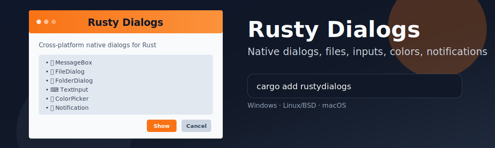

Rusty Dialogs
=============

[](https://opensource.org/licenses/MIT)
[](https://crates.io/crates/rustydialogs)
[](https://docs.rs/rustydialogs)
[](https://github.com/CasualX/rustydialogs/actions/workflows/check.yml)



Rusty Dialogs is a Rust library that provides a simple and cross-platform way to display native dialog boxes and notifications.

Dialogs
-------

The library supports the following types of dialogs: [MessageBox](https://docs.rs/rustydialogs/latest/rustydialogs/struct.MessageBox.html), [FileDialog](https://docs.rs/rustydialogs/latest/rustydialogs/struct.FileDialog.html), [TextInput](https://docs.rs/rustydialogs/latest/rustydialogs/struct.TextInput.html), [ColorPicker](https://docs.rs/rustydialogs/latest/rustydialogs/struct.ColorPicker.html), and [Notification](https://docs.rs/rustydialogs/latest/rustydialogs/struct.Notification.html).

Platform Support
----------------

See [testreport.md](testreport.md) for details on supported dialog types and features per platform and backend.

### Windows

Extensively tested on Windows 10 and 11.

- Win32-based legacy dialogs compatible with any COM apartment model.

- By default, notifications use a tray icon with balloon tips.

- Optional WinRT-Toast notifications are available on Windows 10 and later. (feature: `winrt-toast`)

### Linux & BSDs

Extensively tested on Linux Ubuntu 24 LTS.

- By default, executable-based backends (`kdialog` and `zenity`) are used.

- Optional GTK3 and GTK4 backends are available with libnotify-based notifications. (feature: `gtk3`, `gtk4`)

- XDG desktop portal support is also available, but limited to file and folder dialogs. (feature: `xdg-portal`)

### macOS

Untested on macOS. No testreport yet.

- By default, AppleScript-based dialogs are used.

- Optional AppKit-based dialogs and notifications are also available. (feature: `appkit`)

Development
-----------

To check the code on all supported platforms, run the following command:

```bash
cargo check --examples --all-features
cargo check --examples --target=x86_64-pc-windows-gnu
cargo check --examples --target=x86_64-unknown-linux-gnu
cargo check --examples --target=aarch64-apple-darwin
```

To test the Windows implementation on Linux, you can use the `wine` compatibility layer:

```bash
cargo build --examples --target=x86_64-pc-windows-gnu
wine target/x86_64-pc-windows-gnu/debug/examples/message_box.exe
```

Testing
-------

Use the interactive test runner example:

```bash
cargo run --example tests
```

Run one dialog group directly:

```bash
cargo run --example tests -- m  # MessageBox
cargo run --example tests -- o  # OpenFileDialog
cargo run --example tests -- s  # SaveFileDialog
cargo run --example tests -- f  # FolderDialog
cargo run --example tests -- t  # TextInput
cargo run --example tests -- c  # ColorPicker
cargo run --example tests -- n  # Notification
```

The runner is interactive and will:

- Show what to click for each step
- Ask for retry on failures
- Print environment info (`rustc -V`, `cargo -V`, OS, backend env)

### Windows

Run the full test suite with:

```bash
cargo run --example tests
cargo run --example tests --features winrt-toast -- n
```

### Linux & BSDs

Run the full test suite with different backends:

```bash
RUSTY_DIALOGS_BACKEND=gtk3 cargo run --example tests --features gtk3
RUSTY_DIALOGS_BACKEND=gtk4 cargo run --example tests --features gtk4
RUSTY_DIALOGS_BACKEND=xdg-portal cargo run --example tests --features xdg-portal
RUSTY_DIALOGS_BACKEND=kdialog cargo run --example tests
RUSTY_DIALOGS_BACKEND=zenity cargo run --example tests
```

Run the full Windows test suite under Wine with:

```bash
cargo build --examples --target=x86_64-pc-windows-gnu
wine target/x86_64-pc-windows-gnu/debug/examples/tests.exe
```

### macOS

Run the full test suite with backends:

```bash
cargo run --example tests
cargo run --example tests --features appkit
```

### Pull Request Template

Run at least one default run for your host OS, plus any backend/feature combinations touched by your PR, and attach the output/report in the PR.

License
-------

Licensed under [MIT License](https://opensource.org/licenses/MIT), see [license.txt](license.txt).

Inspired by [tinyfiledialogs](https://sourceforge.net/projects/tinyfiledialogs/) and [rfd](https://github.com/PolyMeilex/rfd).

### Contribution

Unless you explicitly state otherwise, any contribution intentionally submitted
for inclusion in the work by you, shall be licensed as above, without any additional terms or conditions.
